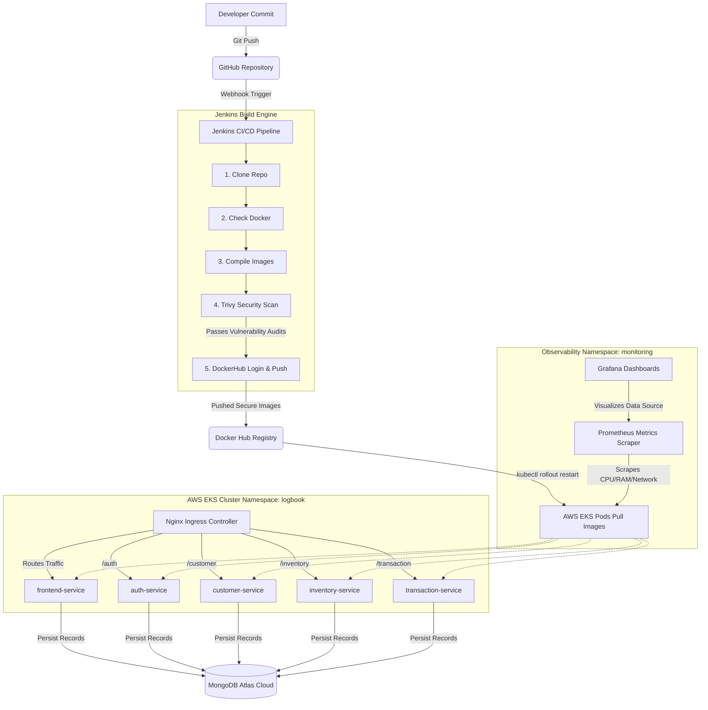

# 📋 LogBook: Cloud-Native DevSecOps Business Management Platform

[](http://localhost:9090)
[](https://aws.amazon.com/eks/)
[](https://hub.docker.com/)
[](https://github.com/aquasecurity/trivy)
[](https://www.mongodb.com/atlas)
[](http://localhost:3000)

LogBook is a production-grade, highly available, and microservices-driven business management and financial ledger platform. Evolving from a monolithic MERN-stack architecture, it has been re-architected into containerized microservices and deployed onto **Amazon Web Services (AWS) Elastic Kubernetes Service (EKS)** using GitOps and DevSecOps best practices.

---

## 🚀 Architectural Workflow



---

## 📂 Repository Structure

The codebase is organized modularly to decouple frontend interfaces, backend microservices, Kubernetes manifests, and Helm deployment templates:

```directory
.
├── frontend/                   # React.js Single Page Client Application
│   ├── public/                 # Static Assets and Favicons
│   ├── src/                    # React Source Components & Styling
│   ├── index.html              # Core HTML5 Entrypoint
│   ├── package.json            # Client Dependencies & Build Scripts
│   └── vite.config.js          # Vite Configuration Engine
├── services/                   # Decoupled Backend Microservices
│   ├── auth-service/           # User Signups, Logins, Staff, and JWT Generation (Port 3001)
│   ├── customer-service/       # Customer/Supplier Records and Balance Tracking (Port 3002)
│   ├── inventory-service/      # Product Catalog and Inventory Stocks (Port 3003)
│   ├── transaction-service/    # Ledgers, Billing, Sales, and Purchase Actions (Port 3004)
│   └── insights-service/       # AI Insights: analytics, priority customers, reminders (Port 3005)
├── k8s/                        # Declarative Kubernetes Manifests (base — also the EKS/cloud path)
│   ├── auth/                   # Deployment and Service Yaml for Auth Pods
│   ├── customer/                # Deployment and Service Yaml for Customer Pods
│   ├── inventory/               # Deployment and Service Yaml for Inventory Pods
│   ├── transaction/             # Deployment and Service Yaml for Transaction Pods
│   ├── insights/                 # Deployment and Service Yaml for Insights Pods
│   ├── frontend/                 # Deployment and Service Yaml for the React app
│   ├── ingress/                  # Nginx Ingress path-based routing rules
│   ├── kustomization.yaml        # Lists the resources above as one kustomize base
│   └── secret.example.yaml       # Template for the logbook-secrets Secret (copy to secret.yaml)
├── k8s-local/                   # Kustomize overlay: same manifests, images retagged :local
├── scripts/deploy-local.ps1      # One-command build + deploy to Docker Desktop's Kubernetes
├── logbook-chart/              # Reusable Helm Chart Package for LogBook
│   ├── templates/              # Deployment & Service Manifest Templates
│   ├── Chart.yaml              # Helm Chart Metadata Definition
│   ├── values.yaml             # Helm Configurable Values for Environments
│   └── .helmignore             # Ignored Chart Development Files
├── docker-compose.yml           # Local run without Kubernetes (docker compose up --build)
├── .env.example                  # Template for local secrets (.env, gitignored)
├── grafana-lb.yaml             # Custom LoadBalancer configuration exposing Grafana Dashboard
├── prometheus-values.yaml      # Custom Prometheus settings for cluster metric collection
└── .gitignore                  # Git Version Control Exclusions
```

---

## 🤖 AI Insights

The **AI Insights** tab (`insights-service`, port 3005) reads across the other services' data — customers, suppliers, inventory, and transactions — to surface:

* **Business summary** — a guessed business type (e.g. "Grocery / Kirana store") inferred from your item catalog, the standout insight in your data, and 2-3 concrete suggestions.
* **Top-selling products**, revenue/collection/payable totals, and low-stock flags.
* **Customer segmentation** by transaction frequency — Frequent / Occasional / One-time / Dormant.
* **Priority customers** — who owes the most, weighted by how stale their last activity is — and **suppliers you owe**, each with a one-click "Remind"/"Schedule Payback" action.
* **Reminders** — tied to a customer or supplier, with a type (call, order follow-up, payment request, supplier payback, note), a due date, and an optional drafted message. A friendly popup shows on login (once per browser session) for anything due today, tomorrow, or overdue.

**AI is optional, not required.** Set `ANTHROPIC_API_KEY` (see `.env.example` / `k8s/secret.example.yaml`) to get real AI-generated business summaries and reminder message drafts from Claude. Without a key, every feature above still works — the business summary and reminder drafts fall back to rule-based, templated text instead (the UI labels which one you're seeing). Get a key at [console.anthropic.com](https://console.anthropic.com).

---

## ⚙️ DevOps Technology Stack

| Layer | Technology | Version | Purpose & Implementation Scope |
|---|---|---|---|
| **Frontend UI** | React.js / Vite | `v18+` | Dynamic UI dashboard, local storage auth state management |
| **Backend API** | Node.js / Express.js | `v20-alpine` | Autonomous Express services serving API endpoints over ports `3001`-`3005` |
| **Database** | MongoDB Atlas | `v6.x Cloud` | Scalable NoSQL cloud document store connected via TLS SRV strings |
| **Local Tools** | Chocolatey | `v2.5.1` | Local Windows package manager automating tooling installation |
| **Container Engine**| Docker / Desktop | `Latest` | Local image builds and container virtualization environment |
| **Orchestration** | Kubernetes (EKS) | `v1.34+` | Container scheduling, replication, service discovery, and scaling |
| **Deploy Tool** | eksctl | `v0.226.0` | Command line controller automating EKS cluster management |
| **CI/CD** | Jenkins | `v2.x LTS` | Automation pipeline pulling git code and deploying builds upon commit |
| **DevSecOps** | Trivy Scanner | `Latest` | Image vulnerability audits preventing insecure package deployments |
| **Package Manager**| Helm | `v3.x` | Kubernetes packaging engine deploying Prometheus/Grafana stacks |
| **Observability** | Prometheus & Grafana | `Latest` | Node metrics scraping and visual dashboards (Template ID `1860`) |
| **Load Balancer** | Nginx Ingress | `Latest` | Dynamic path-based routing exposing all services via a single AWS ELB |

---

## 📦 Containerization & Microservices Build

### Multi-Stage Dockerfile (React Frontend)
To optimize static serving and minimize image sizes, the frontend utilizes a **multi-stage build**:

```dockerfile
# Stage 1: Compiling React static assets
FROM node:20-alpine AS build
WORKDIR /app
COPY package*.json ./
RUN npm install
COPY . .
RUN npm run build

# Stage 2: Production serving via NGINX
FROM nginx:alpine
COPY --from=build /app/dist /usr/share/nginx/html
EXPOSE 80
CMD ["nginx", "-g", "daemon off;"]
```
* **Benefit**: Excluded heavy Node runtimes and development modules, shrinking the production image size from `~1.2 GB` to just `~28 MB` for fast container pull actions.

### Backend Microservice Dockerfile
Backend services (`auth`, `customer`, `inventory`, `transaction`) run on dedicated Node.js runtimes:

```dockerfile
FROM node:20-alpine
WORKDIR /app
COPY package*.json ./
RUN npm ci --omit=dev
COPY . .
USER node
EXPOSE 3000  # Exposed service-specific ports (3001-3005)
CMD ["node", "server.js"]
```

---

## ☸️ Kubernetes Configurations & Namespace Isolation

To enforce resource isolation and operational organization, we partitioned resources across dedicated **Kubernetes Namespaces**:

* `logbook`: Houses core business deployments (`frontend-service`, `auth-service`, `customer-service`, `inventory-service`, `transaction-service`).
* `monitoring`: Hosts observability tools (`prometheus-server`, `grafana-dashboard`, `alertmanager`, `node-exporter`).
* `ingress-nginx`: Configures ingress load balancers.

### Single Load Balancer exposing all Services
Instead of creating expensive LoadBalancer configurations for every service, we deployed a unified **Nginx Ingress Controller** inside EKS:

```yaml
apiVersion: networking.k8s.io/v1
kind: Ingress
metadata:
  name: logbook-ingress
  namespace: logbook
spec:
  ingressClassName: nginx
  rules:
    - http:
        paths:
          - path: /api/auth
            pathType: Prefix
            backend:
              service:
                name: auth-service
                port:
                  number: 80
          - path: /api/staff
            pathType: Prefix
            backend:
              service:
                name: auth-service
                port:
                  number: 80
          - path: /api/parties
            pathType: Prefix
            backend:
              service:
                name: customer-service
                port:
                  number: 80
          - path: /api/inventory
            pathType: Prefix
            backend:
              service:
                name: inventory-service
                port:
                  number: 80
          - path: /api/transactions
            pathType: Prefix
            backend:
              service:
                name: transaction-service
                port:
                  number: 80
          - path: /api/insights
            pathType: Prefix
            backend:
              service:
                name: insights-service
                port:
                  number: 80
          - path: /
            pathType: Prefix
            backend:
              service:
                name: frontend-service
                port:
                  number: 80
```
* **Result**: External traffic entering the AWS Elastic Load Balancer (ELB) is dynamically routed internally by path strings to the correct `ClusterIP` services. Note there is deliberately **no** `rewrite-target` annotation: each backend service mounts its routes under this exact same `/api/...` prefix (e.g. `app.use("/api/inventory", inventoryRoutes)` in `inventory-service/server.js`), and the frontend calls these same relative `/api/...` paths — so the path has to pass through unchanged for the two sides to agree on it. The live manifest is [k8s/ingress/ingress.yaml](k8s/ingress/ingress.yaml).

---

## 🔗 Jenkins Automated CI/CD Pipeline

Jenkins orchestrates the automated lifecycle of code-to-cloud delivery. Webhooks alert Jenkins of code pushes, executing the following stages defined in our `Jenkinsfile`:

```groovy
pipeline {
    agent any
    environment {
        DOCKER_HUB_CRED = 'dockerhub-credentials-id'
        NAMESPACE = 'logbook'
    }
    stages {
        stage('Clone Repository') {
            steps {
                git branch: 'main', url: 'https://github.com/VaishnaviSaw01/logbook.git'
            }
        }
        stage('Check Docker') {
            steps {
                sh 'docker info'
            }
        }
        stage('Build Docker Images') {
            steps {
                sh 'docker build -t vaishnavisaw01/auth-service:latest ./services/auth-service'
                sh 'docker build -t vaishnavisaw01/frontend-service:latest ./frontend'
                // Built remaining service images...
            }
        }
        stage('Trivy Security Scan') {
            steps {
                sh 'trivy image --severity HIGH,CRITICAL vaishnavisaw01/auth-service:latest'
            }
        }
        stage('DockerHub Login & Push') {
            steps {
                // --password-stdin instead of -p: passing a secret as a
                // CLI argument leaks it into `docker history`/process
                // listings and Jenkins console output.
                withCredentials([usernamePassword(credentialsId: "${DOCKER_HUB_CRED}", usernameVariable: 'USER', passwordVariable: 'PASS')]) {
                    sh 'echo "$PASS" | docker login -u "$USER" --password-stdin'
                }
                sh 'docker push vaishnavisaw01/auth-service:latest'
                sh 'docker push vaishnavisaw01/frontend-service:latest'
                // Pushed remaining service images...
            }
        }
        stage('Kubernetes Deploy (Rolling Update)') {
            steps {
                sh 'kubectl rollout restart deployment/auth-service -n ${NAMESPACE}'
                sh 'kubectl rollout restart deployment/frontend-service -n ${NAMESPACE}'
                // Triggered remaining rolling updates...
            }
        }
    }
}
```

---

## 📊 Observability (Prometheus & Grafana)

The monitoring engine was deployed via Helm to the cluster:

```bash
# Register Helm repositories
helm repo add prometheus-community https://prometheus-community.github.io/helm-charts
helm repo add grafana https://grafana.github.io/helm-charts
helm repo update

# Install monitoring tools
helm install prometheus prometheus-community/prometheus --namespace monitoring --create-namespace -f prometheus-values.yaml
helm install grafana grafana/grafana --namespace monitoring
```

* **Grafana Dashboard Verification**:
  - Expose Grafana externally: `kubectl expose service grafana --type=LoadBalancer --name=grafana-ext -n monitoring`.
  - Dashboard ID `1860` (Node Exporter Full) was imported to view real-time metrics showing CPU utilization, memory pressure, pod volumes, and cluster node health.

---

## 🛠️ Technical Challenges & Troubleshooting Resolutions

### 1. EKS Cluster Creation Failure on T3 Medium Nodes
* **Challenge**: The initial plan was to build EKS with T3 medium instances. However, AWS student account quota limits and vCPU restriction bounds rejected the creation, causing CloudFormation stacks to fail (`CREATE_FAILED`).
* **Resolution**: Cleaned up failed stacks and provisioned EKS using **T3 small** instances (`eksctl create cluster --name logbook-cluster --node-type t3.small --nodes 2`). 

### 2. Pod Pending State & Memory Starvation on T3 Small
* **Challenge**: T3 small instances only have 2GB RAM. Running 5 microservice pods alongside Prometheus, Alertmanager, node-exporter, and Grafana exceeded node capacity, causing pods to remain in a `Pending` state.
* **Resolution**: Adjusted the resource allocations within the Kubernetes YAML manifests, defining strict requests and limits:
  ```yaml
  resources:
    limits:
      cpu: "300m"
      memory: "256Mi"
    requests:
      cpu: "100m"
      memory: "128Mi"
  ```
  This allowed Kubernetes to efficiently schedule and fit all workloads on the nodes.

### 3. Docker Daemon Permission Denied in Jenkins
* **Challenge**: Jenkins build steps failed with socket access permission errors during `docker build`.
* **Resolution**: Mounted the host workstation's Docker socket directory into the Jenkins container filesystem:
  ```bash
  docker run -d --name jenkins -p 9090:8080 -v /var/run/docker.sock:/var/run/docker.sock -v jenkins_home:/var/jenkins_home jenkins/jenkins:lts
  ```
  And configured group privileges to allow the Jenkins process access to `/var/run/docker.sock`.

---

## 🚀 How to Run the Environment

### 1. Build and Run Locally (Docker Compose)
Copy `.env.example` to `.env` and fill in a real `MONGO_URI` and `JWT_SECRET` first — every service (including the frontend's Vite dev proxy setup) reads these. Then, to run the microservices environment locally with a single command:
```bash
cp .env.example .env   # then edit .env with real values
docker compose up --build
```
Access the local frontend client at `http://localhost:80` (it reverse-proxies `/api/*` to each backend service internally — see `frontend/nginx.conf`) or hit each backend API directly on ports `3001`-`3005`.

For frontend-only development without Docker, `cd frontend && npm run dev` starts the Vite dev server with the same `/api/*` proxying (see `frontend/vite.config.js`) against backend services you run separately with `npm run dev` in each `services/*` directory.

### 2. Run on a Free Local Kubernetes Cluster (Docker Desktop)
No cloud account needed — this uses Docker Desktop's built-in single-node Kubernetes, which you already have if Docker Desktop is installed (Settings → Kubernetes → **Enable Kubernetes**, then Apply & Restart; wait for the green "Running" indicator bottom-left).

Everything below is automated by [scripts/deploy-local.ps1](scripts/deploy-local.ps1):
```powershell
Copy-Item .env.example .env   # then edit .env with real MONGO_URI / JWT_SECRET
.\scripts\deploy-local.ps1
```
It builds all 5 images tagged `:local` directly into Docker Desktop's own image store (no registry, no push — see `k8s-local/kustomization.yaml`), creates the `logbook-secrets` Secret from `.env`, installs `ingress-nginx` via Helm if it isn't already there, applies the app, waits for every pod to be ready, and does a quick timed request against each service through the ingress so you can see both "is it up" and "how fast" in one go. Docker Desktop auto-publishes the ingress controller's `LoadBalancer` Service on `localhost` — no `minikube tunnel` or NodePort juggling needed. Open **http://localhost** when it finishes.

To do it by hand instead of the script: `docker build` each of the 5 images with the `:local` tag (see the script for exact names/paths), then `kubectl apply -k k8s-local` after creating the namespace/secret as shown in step 4 below (swap `-f k8s/<service>/` for `-k k8s-local` and you're using the same local-image overlay).

Tear down with `kubectl delete -k k8s-local` (leaves `ingress-nginx` and the secret in place for next time).

**On latency**: everything from your browser through the ingress to each service stays on your machine — that part is already about as fast as HTTP gets. `MONGO_URI` still points at MongoDB Atlas (a cloud database) by default, so every database read/write pays a real network round trip to Atlas regardless of the k8s setup; that's the one latency cost this local setup doesn't remove. Swapping in a self-hosted MongoDB (e.g. a `mongo` container in the same cluster) would eliminate it if you want to go further.

### 3. Connect to AWS EKS Cluster
Initialize CLI context to map commands to your EKS cluster:
```bash
aws eks update-kubeconfig --region ap-south-1 --name logbook-cluster
```

### 4. Create the Secret
All four backend deployments read `MONGO_URI` and `JWT_SECRET` from a Kubernetes Secret named `logbook-secrets` (see `k8s/secret.example.yaml` for the template) — create it before deploying:
```bash
kubectl create namespace logbook
kubectl create secret generic logbook-secrets \
  --namespace logbook \
  --from-literal=MONGO_URI='mongodb+srv://<user>:<password>@<cluster-host>/logbookDB?retryWrites=true&w=majority' \
  --from-literal=JWT_SECRET="$(openssl rand -base64 48)"
```

### 5. Deploy Kubernetes Resources
Apply application workloads and routing policies:
```bash
kubectl apply -f k8s/auth/
kubectl apply -f k8s/customer/
kubectl apply -f k8s/inventory/
kubectl apply -f k8s/transaction/
kubectl apply -f k8s/insights/
kubectl apply -f k8s/frontend/
kubectl apply -f k8s/ingress/
```
Verify the public routing URL:
```bash
kubectl get ingress -n logbook
```

---
*Developed by Vaishnavi Saw | Registration No: 12317469 | Section: 4OM56 | Course: INT377*
